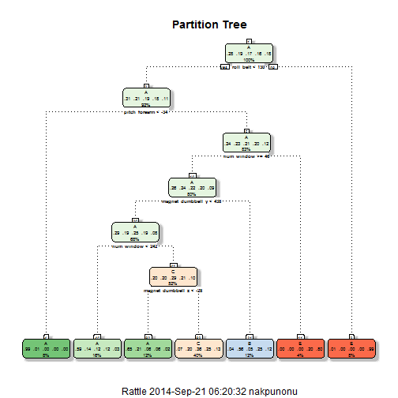
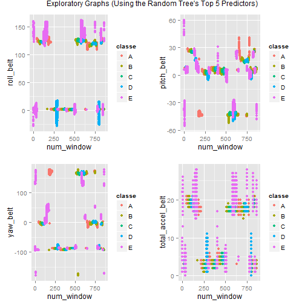

####"Practical Machine Learning Course Project"

**by nakpunonu** -- **09/2014**

####Executive Summary

The proliferation of personal activity monitoring devices has generated a group of enthusiasts who take regular measurements about their physical actitities with an objective to improve their healths and find patterns in their behavior, among other things. It is common for these people to quantify how much of a particular activity they do; however this may not give the complete picture because it could be very helpful to also quantify how well they do it. The aim of the analytical model designed in this document is to fill this gap.

Two models using two similar algorithms, partition tree and random forest, were built. The latter greatly outperformed the former and is therefore my model of choice with an out-of-sample accuracy of approximately `99.6% to 99.8%`. This corresponds to an out-of-sample error rate of approximately `0.2% to 0.4%`. The response variable is the classe variable. The most important predictors in this model include measurements for num_window, roll_belt, pitch_belt, yaw_belt, total_accel_belt.

The final model was applied to a test set (assigned by the instructor) of 20 observations. The response variable, classe, was correctly predicted in all 20 cases resulting in an accuracy of `100%`.

####Data Preparation


After reading in the data, I generated the distribution of the classe variable to get
more understanding of the data.

```
## 
##      A      B      C      D      E 
## 0.2844 0.1935 0.1744 0.1639 0.1838
```

Blank columns as well as columns with NAs were deleted. This was first done to the testing set and then mirrored in the training set.

```r
missingcols <- is.na(colSums(testing[,7:ncol(testing)]))
names(missingcols) <- NULL #remove vector names (not necessary, just preference)
out <- !missingcols #columns to be removed now identified as TRUE
testing2 <- testing[,7:ncol(testing)][,out] #remove unwanted
testing2 <- cbind(testing[1:6],testing2) #re-attach first couple of columns

#remove same columns from training data set

intersect <- names(training) %in% names(testing2) #columns in both
training2 <- training[,intersect] # select columns from training
training2 <- cbind(training2,training[,160]) #add back y variable
names(training2)[60] <- "classe" #add back y variable, name appropriately
```


Training data was further sub-divided into two sets: 70% to a Training set and 30% to a validation set.

A summary table was generated to get a general idea of the data set.


There were considerations to identify the "near-zero variance" variables but since robust models with trees were going to be built I decided to ignore this step.

####Model 1: Partition Tree

The first model is a Partition Tree. All the remaining predictor variables in the dataset were used to create a partition tree model.

```r
modFit <- train(classe ~ .,method="rpart",data=training3[,7:60])
```

A graphical output of the tree as well as model interpretation is shown below.
 

```
## n= 13737 
## 
## node), split, n, loss, yval, (yprob)
##       * denotes terminal node
## 
##  1) root 13737 9831 A (0.28 0.19 0.17 0.16 0.18)  
##    2) roll_belt< 130.5 12576 8680 A (0.31 0.21 0.19 0.18 0.11)  
##      4) pitch_forearm< -33.95 1108    8 A (0.99 0.0072 0 0 0) *
##      5) pitch_forearm>=-33.95 11468 8672 A (0.24 0.23 0.21 0.2 0.12)  
##       10) num_window>=45.5 10962 8166 A (0.26 0.24 0.22 0.2 0.088)  
##         20) magnet_dumbbell_y< 437.5 9322 6584 A (0.29 0.19 0.25 0.19 0.083)  
##           40) num_window< 241.5 2241  910 A (0.59 0.14 0.12 0.12 0.027) *
##           41) num_window>=241.5 7081 5026 C (0.2 0.2 0.29 0.21 0.1)  
##             82) magnet_dumbbell_z< -27.5 1580  555 A (0.65 0.21 0.064 0.065 0.017) *
##             83) magnet_dumbbell_z>=-27.5 5501 3547 C (0.069 0.2 0.36 0.25 0.13) *
##         21) magnet_dumbbell_y>=437.5 1640  729 B (0.035 0.56 0.046 0.25 0.12) *
##       11) num_window< 45.5 506   99 E (0 0 0 0.2 0.8) *
##    3) roll_belt>=130.5 1161   10 E (0.0086 0 0 0 0.99) *
```

**Interpretation:** For instance, an obsevation with a roll_belt value less than 130.5, a pitch_forearm value greater than -34 and a num_window value greater than or equal to 46 is classifed in the E classe.

#####Cross-Validation

The classification matrix (on the validation data) is generated below:

```
##           Reference
## Prediction    A    B    C    D    E
##          A 1462   32  176    0    4
##          B  290  385  464    0    0
##          C  155   33  838    0    0
##          D  149  174  594    0   47
##          E   48   88  300    0  646
```

#####In-Sample and Out-of-Sample Error

The estimate of the in-sample accuracy (seen on the training set) is 0.566 and the estimate of the in-sample error rate (seen on the training set) is:

```r
insample1 <- 1 - confusionMatrix1$overall[1]
names(insample1) <- "in-sample error rate"
insample1
```

```
## in-sample error rate 
##                0.434
```

The estimate of the out-of-sample accuracy (seen on the validation set) is 0.5934 and the estimate of the out-of-sample error rate (seen on the validation data) is: 

```r
outsample1 <- 1 - modFit$results[1,2]
names(outsample1) <- "out-of-sample error rate"
outsample1
```

```
## out-of-sample error rate 
##                   0.4066
```

Due to dissatisfaction with the low accuracy of this model, a random forest model is developed next.

####Model 2: Random Forest

The second model is a Random Forest. All the remaining predictor variables in the dataset were used.

```r
library(randomForest)
modFit2 <- randomForest(classe ~ .,data=training3[,7:60])
```

#####Cross-Validation

The classification matrix (on the validation data) is generated below:

```
##           Reference
## Prediction    A    B    C    D    E
##          A 1673    0    0    0    1
##          B    3 1136    0    0    0
##          C    0   11 1015    0    0
##          D    0    0    4  958    2
##          E    0    0    0    3 1079
```

#####In-Sample and Out-of-Sample Error

The estimate of the in-sample accuracy (seen on the training set) is 0.9972 and the estimate of the in-sample error rate (seen on the training data) is:

```r
insample2 <- 1 - confusionMatrix(training3$classe,modFit2$predicted)$overall[1]
names(insample2) <- "in-sample error rate"
insample2
```

```
## in-sample error rate 
##             0.002766
```

The estimate of the out-of-sample accuracy (seen on the validation set) is 0.9959 and the estimate of the out-of-sample error rate (seen on the validation data) is:

```r
outsample2 <- 1 - confusionMatrix2$overall[1]
names(outsample2) <- "out-of-sample error rate"
outsample2
```

```
## out-of-sample error rate 
##                 0.004078
```

Due to the increased accuracy of the random forest model over the partition tree model, the random forest model is my model of choice. 
The top 15 (most important) variables in this model are shown below:


```r
head(modFit2$importance,15) #top 15 important variables
```

```
##                  MeanDecreaseGini
## num_window                 951.33
## roll_belt                  790.75
## pitch_belt                 462.58
## yaw_belt                   559.00
## total_accel_belt           160.41
## gyros_belt_x                61.86
## gyros_belt_y                73.66
## gyros_belt_z               195.66
## accel_belt_x                83.93
## accel_belt_y                96.78
## accel_belt_z               281.57
## magnet_belt_x              168.43
## magnet_belt_y              235.97
## magnet_belt_z              248.05
## roll_arm                   219.98
```

Some exploratory graphs to examine some of these variables is shown below. We can clearly see that they can collectively explain the different classe values.

 

####Decision

Due to its high accuracy, the random forest model is selected and is therefore applied to the testing set. Output of its predictions are shown below. When submitted via the class instructor's automated grading, the predictions were 100% accurate.

```
##  1  2  3  4  5  6  7  8  9 10 11 12 13 14 15 16 17 18 19 20 
##  B  A  B  A  A  E  D  B  A  A  B  C  B  A  E  E  A  B  B  B 
## Levels: A B C D E
```

